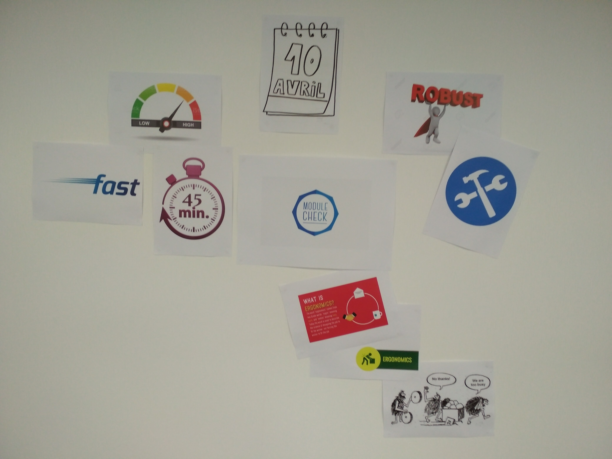
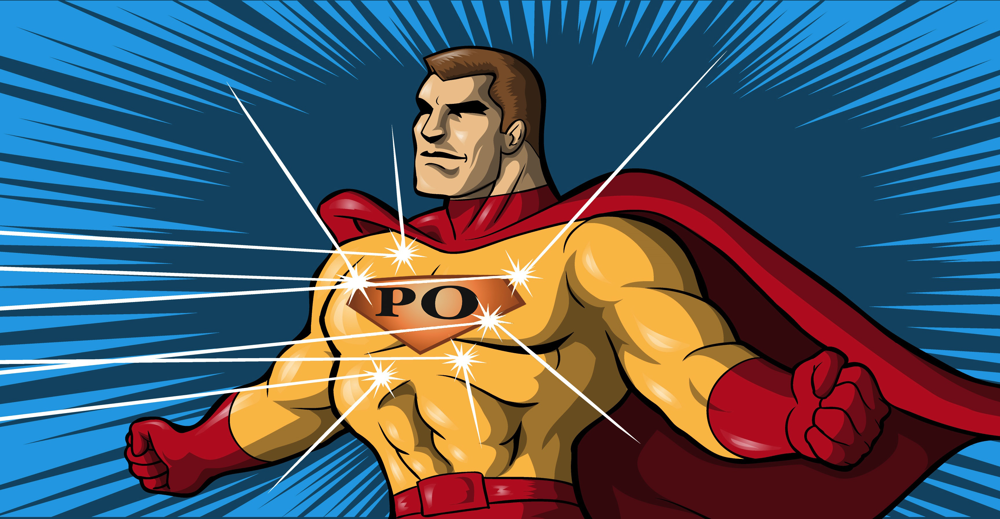

**Tiempo estimado de lectura:** *mejor no hacer estimaciones...* :stuck_out_tongue_winking_eye:

Lo primero de todo quiero dar las gracias a [Peio Roth](https://www.peio.dev) por haber compartido barco en esta aventura "agile", una verdadera experiencia de [product owner](https://proyectosagiles.org/cliente-product-owner/).

Que quede claro, trabajar con alguien excelente tanto como programador, como diseñador, como 'coach' agile y como product owner es muy fácil, sobre todo cuando esa persona es un muy buen compañero de trabajo y amigo (y le encanta irse de tragos).

Juntos hemos creado una herramienta de trabajo, útil 100%, con la consecución de los objetivos iniciales, mejorable (como todos los softwares habidos y por haber), colaborado con nuestros clientes (compañeros en este caso) y utilizado un método de trabajo que puede serme de gran utilidad de aquí en adelante. Y, como no habíamos estimado el tiempo que nos iba a costar, no nos hemos equivocado... o solo un poco...

En la parrafada que he escrito a continuación, detallo más o menos todo lo que hemos hecho sin entrar en detalles técnicos. Puede que sirva a alguien más o no, pero seguro que a mi me recuerda ciertas cosas para los proyectos futuros. No describo nada más y nada menos que lo que se puede leer en los libros, pero habiendolo experimentado, comprobado su valor real y comentado a mi manera. 

## Porque este software?? 

Desde hace tiempo, habiendo trabajado como responsable de producción para una oficina técnica, sé el beneficio cotidiano que tiene el disponer de la herramienta correcta para una tarea especifica (sobre todo sí es repetitiva). 

En [Eove](http://eove.fr/cms/), todo se ha construido rápido, en paralelo, para salir del paso y bastante bastante bien. Es gracias a programas como el que asiste a los operadores a controlar los aparatos antes de mandarlos al cliente, que la empresa es lo que es hoy. Estando en el puesto de validación y verificación, como casi todo lo que se ha desarrollado en la empresa durante los primeros 4 años, ese programa ha pasado por mis manos, manipulado, estresado, corregido e instalado en producción. Esto no quita que, todas las mañanas al saludar a mis colegas de curro de producción (si, todas las mañanas nos saludamos TODOS en la empresa) vea que el programa que un día convirtió la fabricación artesanal en un cadena de producción, se haya quedado obsoleto, lleno de errores y tenga la misma ergonomía que una rueda cuadrada. 

Tras varios intentos y siguiendo nuestro objetivo de liquidar esa deuda técnica creada por necesidad, nos han concedido 2 meses (más o menos) para crear/completar/inventar un software que mejore el día a día de la producción, ayude al servicio técnico a diagnosticar y reparar y permita a Eove de producir más rápido.

## Antes de empezar

### 1. Objetivos

Primera parte super importante en el comienzo de un proyecto, sea el que sea. Muchos son los objetivos, pero pocos (solo los verdaderamente importantes) deben ser los abordados para delimitar el perímetro de acción. Creo que todo product owner, jefe de proyecto, etc... debería de aplicarse el refrán "el que mucho abarca, poco aprieta".

Así que nosotros, elegimos los siguientes...

- **Rapidez**: la producción necesita poder controlar rápido.
- **Fiabilidad**: durante el control, solamente el dispositivo fabricado puede fallar, el programa de control tiene que funcionar sí o sí (una herramienta que funciona siempre hace ganar tiempo igualmente).
- **Ergonomía**: un trabajo repetitivo es aburrido siempre, pero al menos que sea fácil de utilizar y agradable a la vista.

...y los hemos tenido delante durante todo el desarrollo, justo enfrente de nuestros puestos de trabajo, y en una zona de paso. El resultado es que nosotros no nos hemos olvidado en ningún momento, los demás han tenido curiosidad y sin quererlo ni beberlo, todo el mundo estaba al día de que se quería conseguir con este software.

### 2. Ubiquitous Language

Segunda parte esencial en el comienzo de un proyecto, sea el que sea. En toda comunicación, utilizar un lenguaje común es necesario para que la transmisión de información sea optima. La receta que hemos utilizado es la siguiente:

Ingredientes:
- 1m2 de pizarra
- 500gr idea general del programa/aplicación que se va a crear
- 2 cucharadas de inglés técnico

Pasos a seguir para obtener un suculento _ubiquitous language_:
1. Se listan las partes del software/aplicación.
2. Todo el mundo toma nota y pregunta si no queda claro.
3. Todo el mundo lo utiliza desde el principio, sin excepciones, tanto en la comunicación verbal, como en la redacción de tickets/tareas.
4. Corregir al compañero es obligatorio, y solamente debe de tomarse como algo constructivo y nunca como una crítica banal.

De esta manera, no hay lugar a errores de comunicación/interpretación, es decir, de trabajo en vano, pérdida de tiempo, retraso en el planning, conflicto entre compañeros de equipo, etc...

### 3. Definition of Done

Tercero y último, ponerse de acuerdo en que es lo que cada uno tiene que hacer para considerar que una tarea está totalmente terminada y se puede pasar a otra cosa. Es la única manera de no dejar las cosas a medias, de no dejar para el final lo menos agradable y de mantener una visión clara/instantánea del avance del proyecto. Y lo mejor, permite de versionar prácticamente en todo momento, y eso es oro.

## Gestión del proyecto

### TODAS las estimaciones son falsas

Casi todos los proyectos necesitan un plazo, los internos porque hay otros proyectos esperando y los externos porque hay que poder presupuestarlos. Nosotros hemos tenido la suerte de anunciar una fecha aproximada, equivocarnos sin que nadie nos diga nada y liberar el software cuando lo hemos considerado maduro y funcional, pero eso no suele pasar. Así que cuando un superior o un cliente pide una estimación con un planning detallado, hay que hacerle saber que va a ser erróneo de un porcentaje muy elevado y que el tiempo del planning detallado es mejor utilizarlo en hacer avanzar el proyecto que en equivocarse detalladamente. Lo ideal seria el poder contestar: "estará terminado cuando esté terminado", pero eso es difícil de soltarselo a tu jefe/responsable/etc...

### El PO negocia y tiene la obligacion de decir NO

Siempre, durante la vida de un proyecto, las prioridades cambian, se nos ocurren cosas, se puede mejorar el diseño, etc.. pero todo eso impacta el trabajo del PO, que debe respetar los plazos y que ha _diseñado su backlog_ de manera óptima. La negociación del PO en estos casos es primordial, y pasa por el NO y, a seguido, por la priorización. Cuando se define el scope de un proyecto, hay que tener en cuenta que esto sucederá y hay que estar preparado si se quiere llegar a buen puerto. 

### Pocos tickets, pero buenos

No sirve de nada llenar el backlog o el TODO con cientos de tickets, crear por no olvidar, crear todos y sentirse aliviado... NO. 

1. Shit IN = Shit OUT (mierda a la entrada =  mierda a la salida)
2. Menos tickets = más fácil de priorizar = MVP
3. Menos tickets = más parece que avanzamos, más lejos del suicidio estará nuestro programador
4. Si un ticket es importante, se volverá a hablar de él y podremos incluirlo en el momento adecuado.
5. Un ticket tiene que escribirse cuando se tiene claro lo que se tiene que hacer y se dispone del tiempo necesario para crearlo correctamente. Los tickets con solamente un título no deben crearse (excepto si lo hace el programador "toto" para resolverlo el mismo; sí, los programadores tienen más derechos que el PO).

### La doc, poco a poco y con cabeza

La documentación es muchas veces desagradable, aburrida, repetitiva... sobre todo si se deja para el final. Sin embargo, si en la _definition of done_ se decide que la doc tiene que hacerse a la vez, el mal trago es más frecuente pero menos largo. Esto permite igualmente de estructurar la doc con cabeza (y no apelotonar todo sin orden ni concierto) de manera que una persona exterior al proyecto que tenga que intervenir (o incluso el cliente) sepa encontrar lo que necesita o ejecutar un test de manera fácil y sencilla.

### Tests unitarios: sí o sí

Toda aplicación/software que no cuente con un buen paqueton de test unitarios que se lancen con frecuencia sufrirá regresiones que pasaran inadvertidas durante la verificación y lo más probable es que se vea una vez que se haya liberado. Y eso es así.

### Una demo vale más que mil palabras

Cuando el software comienza a ser presentable, no hay que dudar en mostrarlo a los individuos interesados, sobre todo si pueden darte información, opiniones y/o criticas que puedan ayudarte en la consecución de tus objetivos. De esta manera se consiguen varias cosas:

- *Feedback/use experience*: No se sabe si se està haciendo bien hasta que el usuario confirma, comenta y critica. Incluso si el PO debe ir a buscar esa valiosa información antes de nada, a veces se toman decisiones que parecen buenas en el seno del equipo, pero que no lo son del todo (o para nada) cuando se trata del usuario. Nadie mejor que el usuario (sobre todo si tiene experiencia con programas precedentes) sabe que es lo que le cuesta más, que es lo que le ayudará en el dia a dia y que es lo que le saca de quicio. Todo eso se tiene que reinyectar progresivamente (siempre y cuando no provoque el hundimiento del barco) y mostrarlo a esos usuarios finales porque, al final, son ellos los que van a utilizar ese programa cada dia.
- *El mejor GPS*: Si el proyecto empieza a coger una direccion erronea, los clientes presentes en la demostración enseguida lo detectarán y lo harán saber. Así se evitan las derivas, la pérdida de tiempo, el agotamiento del presupuesto y tirar el programa a la basura porque ya es demasiado tarde.
- *Confianza*: si el cliente/usuario del proyecto vé que sus comentarios y propuestas cogen forma cada semana, se crea un vínculo con el equipo de desarrollo que tiene mucho,volar. El poder ver y manipular ese programa antes de encontrarselo instalado en su PC un martes por la mañana y estar obligado a utilizarlo sin quererlo ni beberlo, facilitará su aceptación.

##CONCLUSIONES (de los errores siempre se aprende)

- Tu programador es tu amigo, tratalo bien.
- La fase de preparación del proyecto es obligatoria y hay que tomarse el tiempo necesario.
- Cuanto más curioso es un PO, más información sonsacara al cliente (marketing, usuario final, etc...) y de mejor calidad será el INPUT.
- Hay que sentarse al lado del usuario final y dejarle _zarcear_, ese será tu mejor FEEDBACK.
- Una demo regular transmite confianza y buen ambiente.
- La negociación es primordial para llegar a buen puerto.
- El PO hace mucha faena en la sombra, pero pienso que es indispensable para cualquier proyecto.

